# 🚀 Shigosag POS

[](https://www.typescriptlang.org/)
[](https://nodejs.org/)
[](LICENSE)

A modern, real-time POS (Point of Sale) system for web and mobile. Built with **React**, **TypeScript**, **Vite**, **Express**, **Prisma**, **PostgreSQL**, **Socket.IO**, and **Expo**.

| Light Mode | Colored Mode |
| :---: | :---: |
| 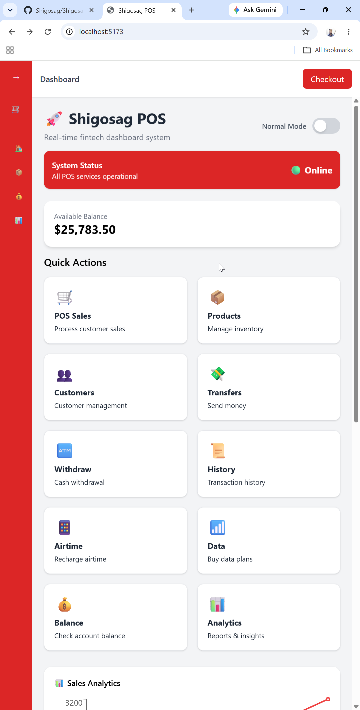 | 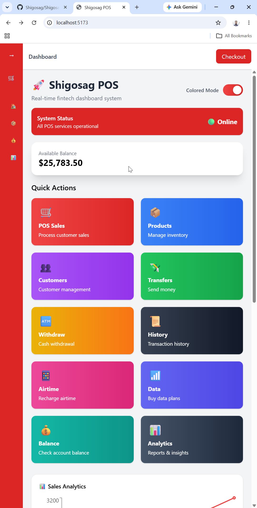 |

### 🎥 System Walkthrough & Demo

<div align="center">
  <video src="https://github.com/user-attachments/assets/18b4d967-9126-4b85-8b3f-bfb8cd6147fb" width="100%" controls></video>
</div>

**Timestamps:**
- **0:00** - Dashboard Colored Mode Overview
- **0:19** - Dashboard Light Mode Overview
- **0:35** - Sidebar Overview
- **1:15** - History Overview
- **1:39** - Checkout Overview
- **2:16** - GitHub Repository Overview

---

## ✨ Features

- 🖥️ Modern, responsive dashboard UI  
- 🔴 Live transactions feed  
- ⚡ Quick actions for sales, products, customers, transfers, and more  
- 🌐 Real-time updates with Socket.IO  
- 💳 Stripe-ready checkout modal (simulated or real)  
- 📊 Analytics and sales chart  
- 📱 Mobile-friendly with Expo app  
- 🔒 Secure and scalable backend  

---

## 🛠️ Tech Stack

| Layer       | Technology                          |
|-------------|-------------------------------------|
| Backend     | Node.js, Express, Prisma, PostgreSQL|
| Frontend    | React, TypeScript, Vite             |
| Mobile      | React Native, Expo                  |
| Real-time   | Socket.IO                           |
| Charts      | Recharts                            |
| Security    | Helmet, CORS                        |
| Payments    | Stripe (placeholder ready)          |

---

## 📂 Project Structure

```txt
Shigosag-Pos/
│
├─ backend/
│  ├─ prisma/
│  │  └─ schema.prisma
│  ├─ src/
│  │  ├─ controllers/
│  │  ├─ routes/
│  │  ├─ middlewares/
│  │  ├─ services/
│  │  └─ index.ts
│  ├─ package.json
│  └─ tsconfig.json
│
├─ frontend/
│  ├─ public/
│  ├─ src/
│  │  ├─ components/
│  │  ├─ layouts/
│  │  ├─ pages/
│  │  ├─ hooks/
│  │  ├─ utils/
│  │  ├─ App.tsx
│  │  └─ main.tsx
│  ├─ package.json
│  └─ vite.config.ts
│
├─ mobile/
│  ├─ assets/
│  ├─ components/
│  ├─ screens/
│  ├─ App.tsx
│  └─ package.json
│
├─ docker-compose.yml
└─ README.md
```
----

## 🖼️ Dashboard Preview

| Light Mode Top Section | Colored Mode Top Section |
| :---: | :---: |
| 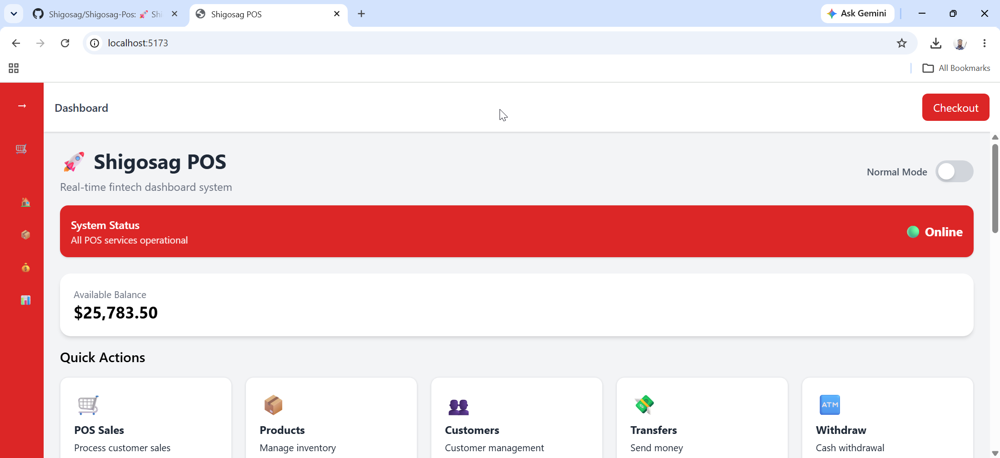 | 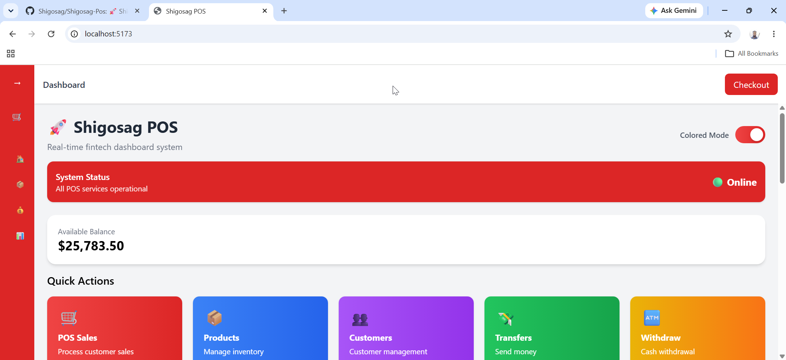 |

| Light Mode Middle Section | Colored Mode Middle Section |
| :---: | :---: |
| 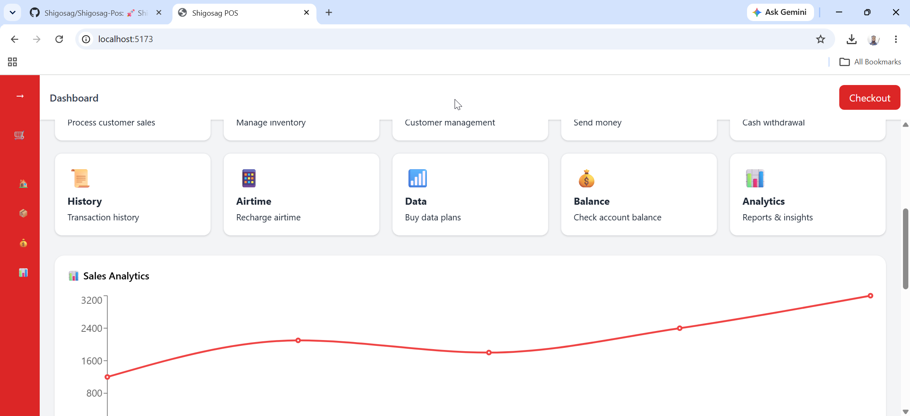 | 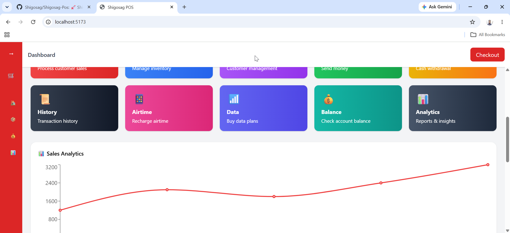 |

| Light Mode Bottom Section | Colored Mode Bottom Section |
| :---: | :---: |
| 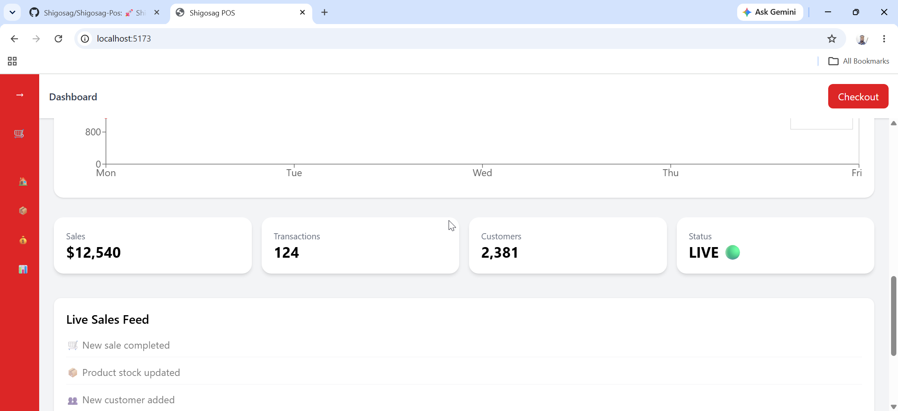 | 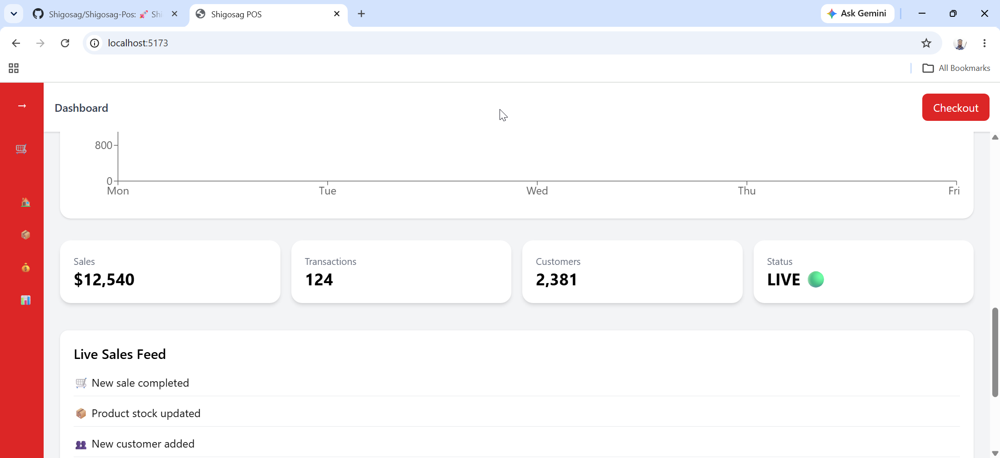 |

| History | Checkout |
| :---: | :---: |
| 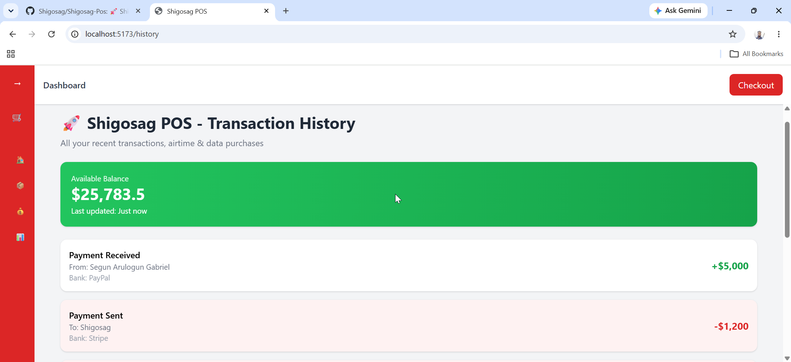 | 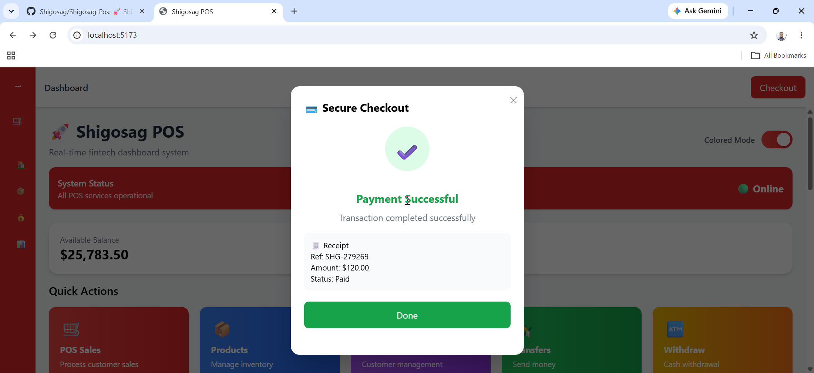 |

---

## ⚡ Installation

## Prerequisites
- Node.js (v18+)

## Clone the repository
```bash
git clone https://github.com/Shigosag/Shigosag-Pos.git
cd Shigosag-Pos
```

## Backend

```bash
cd backend
npm install
npx prisma generate
npm run dev 
```

Browser: http://localhost:5000

## Frontend

```bash
cd frontend
npm install
npm run dev
```

Browser: http://localhost:5173

## Mobile
```bash
cd mobile
npx create-expo-app
npm install 
npx expo start
```

## Or Docker

```bash
docker compose up --build
```

---

## 🖼️ Dashboard Mobile Preview

| Light Mode Top Section | Colored Mode Top Section |
| :---: | :---: |
|  |  |

| Light Mode Bottom Section | Colored Mode Bottom Section |
| :---: | :---: |
| 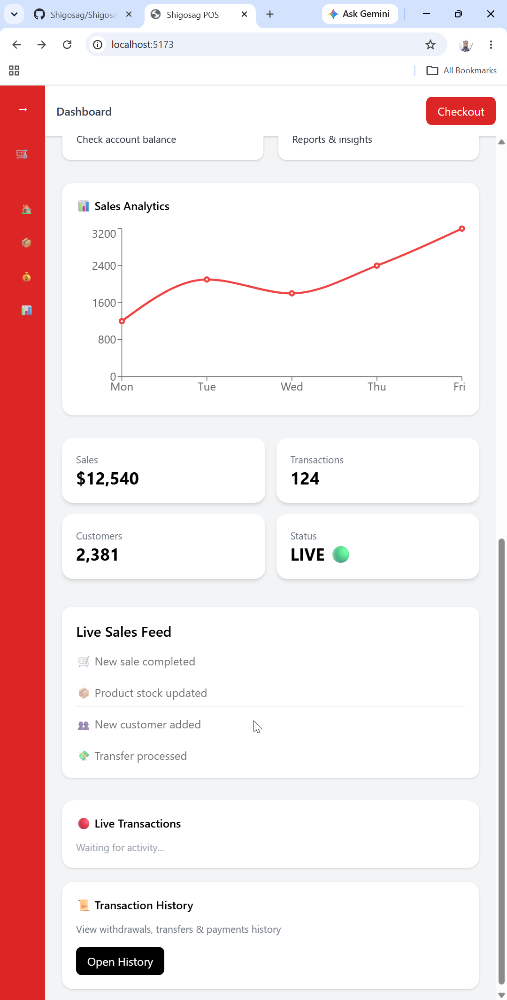 | 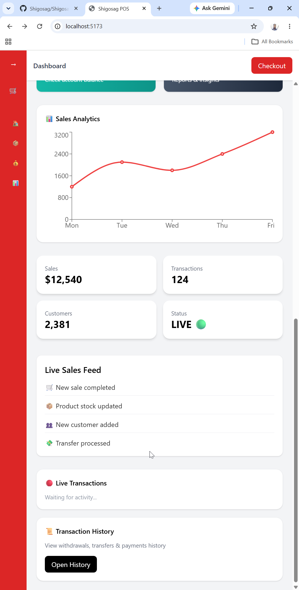 |

| History | Checkout |
| :---: | :---: |
| 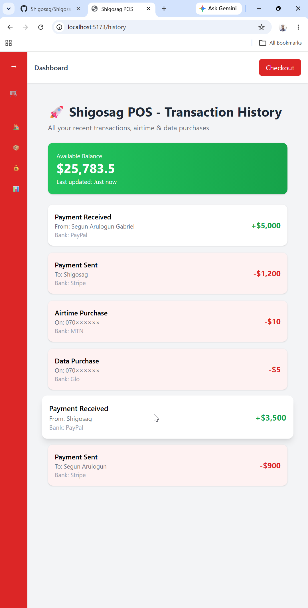 | 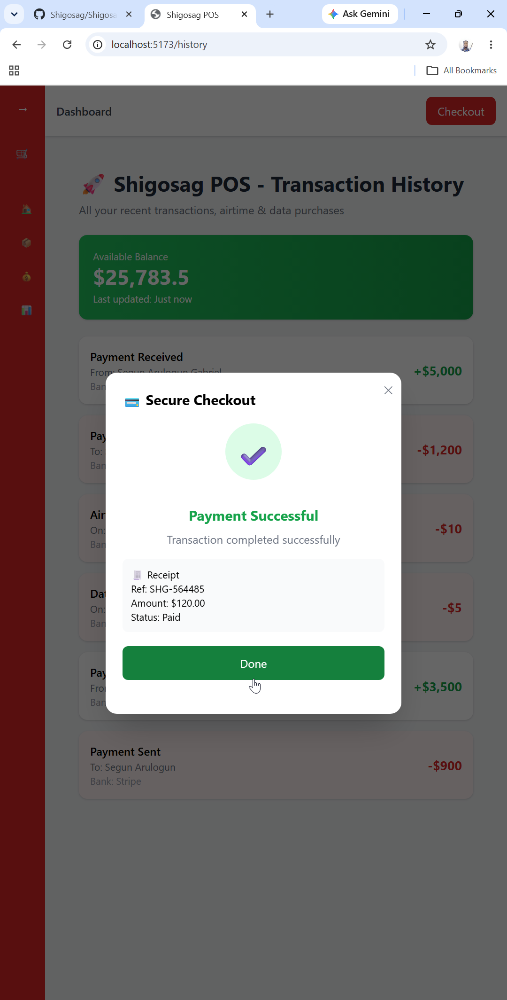 |

---

📜 License

MIT License © 2026 Shigosag

---

## 👤 Author & Credits

- Shigosag
- Portions of code generated with AI support
